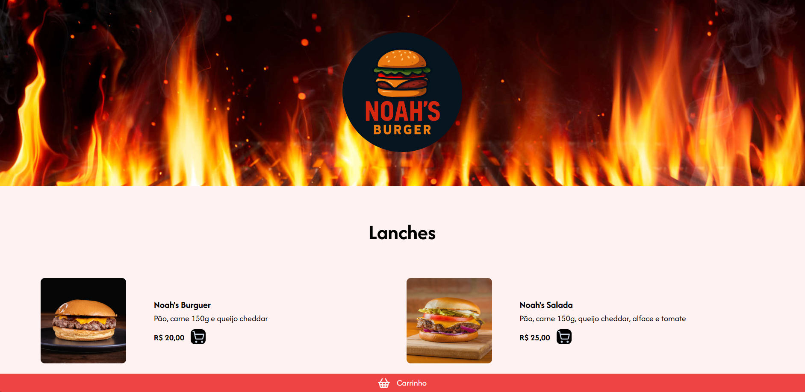

# Descrição

Uma hamburgueria online desenvolvida com React.js e TailwindCSS, o usuário pode navegar pelo cardápio, adicionar itens ao carrinho e finalizar o pedido de forma intuitiva. Ao concluir a compra, todos os dados do pedido são enviados diretamente para o WhatsApp da loja

https://hamburgueria-six-delta.vercel.app/